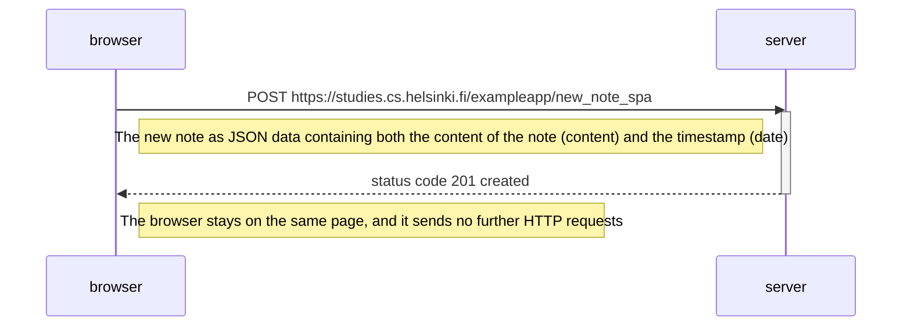

```mermaid

sequenceDiagram
    participant browser
    participant server
   
    browser->>server: POST  https://studies.cs.helsinki.fi/exampleapp/new_note_spa
    activate server
    Note right of browser: The new note as JSON data containing both the content of the note (content) and the timestamp (date)

    server-->>browser: status code 201 created
    deactivate server
    Note right of browser: The browser stays on the same page, and it sends no further HTTP requests

```
